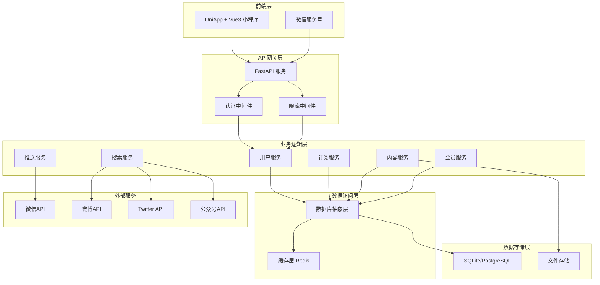

# 设计文档

## 概述

多平台内容聚合微信小程序采用前后端分离架构，后端使用Python + FastAPI构建RESTful API服务，前端使用UniApp + Vue3开发跨平台小程序。系统通过定时任务抓取各平台内容，并通过微信服务号实现实时推送功能。

## 架构设计

### 整体架构



### 技术栈选择

**后端技术栈：**
- **框架**: FastAPI - 高性能异步框架，自动生成API文档
- **数据库**: SQLite (开发) / PostgreSQL (生产) - 支持平滑迁移
- **ORM**: SQLAlchemy - 数据库抽象层，支持多种数据库
- **缓存**: Redis - 高性能缓存和会话存储
- **任务队列**: Celery + Redis - 异步任务处理
- **认证**: JWT - 无状态认证机制

**前端技术栈：**
- **框架**: UniApp + Vue3 - 跨平台开发，支持微信小程序
- **状态管理**: Pinia - Vue3官方推荐状态管理
- **UI组件**: uni-ui - UniApp官方UI组件库
- **HTTP客户端**: uni.request - UniApp内置请求库

## 组件设计

### 1. 用户认证模块

**组件职责：**
- 微信小程序登录授权
- JWT令牌生成和验证
- 用户会话管理

**核心接口：**
```python
class AuthService:
    async def wechat_login(self, code: str) -> UserToken
    async def verify_token(self, token: str) -> User
    async def refresh_token(self, refresh_token: str) -> UserToken
```

### 2. 用户管理模块

**组件职责：**
- 用户信息管理
- 会员等级管理
- 用户偏好设置

**核心接口：**
```python
class UserService:
    async def get_user_profile(self, user_id: int) -> UserProfile
    async def update_membership(self, user_id: int, level: MembershipLevel) -> bool
    async def get_user_limits(self, user_id: int) -> UserLimits
```

### 3. 订阅管理模块

**组件职责：**
- 博主订阅/取消订阅
- 订阅数量限制检查
- 订阅列表管理

**核心接口：**
```python
class SubscriptionService:
    async def subscribe_account(self, user_id: int, account_id: int) -> bool
    async def unsubscribe_account(self, user_id: int, account_id: int) -> bool
    async def get_user_subscriptions(self, user_id: int) -> List[Account]
    async def check_subscription_limit(self, user_id: int) -> bool
```

### 4. 内容聚合模块

**组件职责：**
- 多平台内容抓取
- 内容去重和过滤
- 内容存储和索引

**核心接口：**
```python
class ContentService:
    async def fetch_platform_content(self, platform: str) -> List[Article]
    async def get_user_feed(self, user_id: int, page: int) -> List[Article]
    async def get_article_detail(self, article_id: int) -> Article
```

### 5. 搜索服务模块

**组件职责：**
- 多平台博主搜索
- 搜索结果聚合
- 搜索缓存优化

**核心接口：**
```python
class SearchService:
    async def search_accounts(self, keyword: str, platforms: List[str]) -> List[Account]
    async def search_by_platform(self, keyword: str, platform: str) -> List[Account]
```

### 6. 推送服务模块

**组件职责：**
- 新内容检测
- 推送消息生成
- 微信服务号推送

**核心接口：**
```python
class PushService:
    async def detect_new_content(self) -> List[Article]
    async def send_push_notification(self, user_id: int, article: Article) -> bool
    async def check_push_limit(self, user_id: int) -> bool
```

## 数据模型设计

### 核心数据模型

```python
# 用户模型
class User(BaseModel):
    id: int
    openid: str
    nickname: str
    avatar_url: str
    membership_level: MembershipLevel
    membership_expire_at: datetime
    created_at: datetime
    updated_at: datetime

# 账号模型 (博主)
class Account(BaseModel):
    id: int
    name: str
    platform: Platform
    account_id: str
    avatar_url: str
    description: str
    follower_count: int
    details: dict
    created_at: datetime
    updated_at: datetime

# 文章模型
class Article(BaseModel):
    id: int
    account_id: int
    title: str
    url: str
    content: str
    summary: str
    publish_time: datetime
    publish_timestamp: int
    images: List[str]
    details: dict
    created_at: datetime
    updated_at: datetime

# 订阅关系模型
class Subscription(BaseModel):
    id: int
    user_id: int
    account_id: int
    created_at: datetime

# 推送记录模型
class PushRecord(BaseModel):
    id: int
    user_id: int
    article_id: int
    push_time: datetime
    status: PushStatus

# 会员等级枚举
class MembershipLevel(Enum):
    FREE = "free"
    BASIC = "basic"
    PREMIUM = "premium"

# 平台枚举
class Platform(Enum):
    WECHAT = "wechat"
    WEIBO = "weibo"
    TWITTER = "twitter"
```

### 数据库设计优化

**索引策略：**
```sql
-- 用户表索引
CREATE INDEX idx_user_openid ON users(openid);
CREATE INDEX idx_user_membership ON users(membership_level, membership_expire_at);

-- 账号表索引
CREATE INDEX idx_account_platform_name ON accounts(platform, name);
CREATE INDEX idx_account_platform_id ON accounts(platform, account_id);

-- 文章表索引
CREATE INDEX idx_article_account_time ON articles(account_id, publish_timestamp DESC);
CREATE INDEX idx_article_url ON articles(url);

-- 订阅表索引
CREATE INDEX idx_subscription_user ON subscriptions(user_id);
CREATE INDEX idx_subscription_account ON subscriptions(account_id);
CREATE UNIQUE INDEX idx_subscription_unique ON subscriptions(user_id, account_id);

-- 推送记录表索引
CREATE INDEX idx_push_user_time ON push_records(user_id, push_time DESC);
```

## 接口设计

### RESTful API 设计

**认证相关：**
```
POST /api/v1/auth/login          # 微信登录
POST /api/v1/auth/refresh        # 刷新令牌
POST /api/v1/auth/logout         # 登出
```

**用户相关：**
```
GET  /api/v1/users/profile       # 获取用户信息
PUT  /api/v1/users/profile       # 更新用户信息
GET  /api/v1/users/membership    # 获取会员信息
POST /api/v1/users/membership    # 升级会员
```

**订阅相关：**
```
GET  /api/v1/subscriptions       # 获取订阅列表
POST /api/v1/subscriptions       # 订阅博主
DELETE /api/v1/subscriptions/{id} # 取消订阅
```

**搜索相关：**
```
GET  /api/v1/search/accounts     # 搜索博主
GET  /api/v1/search/platforms    # 获取支持的平台列表
```

**内容相关：**
```
GET  /api/v1/feed                # 获取用户动态流
GET  /api/v1/articles/{id}       # 获取文章详情
```

### API响应格式

```json
{
  "code": 200,
  "message": "success",
  "data": {
    // 具体数据
  },
  "timestamp": 1642752000
}
```

## 错误处理

### 错误码设计

```python
class ErrorCode(Enum):
    SUCCESS = (200, "操作成功")
    INVALID_PARAMS = (400, "参数错误")
    UNAUTHORIZED = (401, "未授权")
    FORBIDDEN = (403, "权限不足")
    NOT_FOUND = (404, "资源不存在")
    SUBSCRIPTION_LIMIT = (4001, "订阅数量已达上限")
    PUSH_LIMIT = (4002, "推送次数已达上限")
    PLATFORM_ERROR = (5001, "平台API调用失败")
    INTERNAL_ERROR = (500, "服务器内部错误")
```

### 异常处理策略

```python
@app.exception_handler(ValidationError)
async def validation_exception_handler(request: Request, exc: ValidationError):
    return JSONResponse(
        status_code=400,
        content={
            "code": 400,
            "message": "参数验证失败",
            "errors": exc.errors()
        }
    )

@app.exception_handler(BusinessException)
async def business_exception_handler(request: Request, exc: BusinessException):
    return JSONResponse(
        status_code=exc.status_code,
        content={
            "code": exc.error_code,
            "message": exc.message
        }
    )
```

## 测试策略

### 测试层级

**单元测试：**
- 业务逻辑层测试覆盖率 > 90%
- 数据访问层测试覆盖率 > 80%
- 使用pytest + pytest-asyncio

**集成测试：**
- API接口测试
- 数据库集成测试
- 外部服务Mock测试

**端到端测试：**
- 关键业务流程测试
- 用户场景测试

### 测试工具和框架

```python
# 测试依赖
pytest==7.4.0
pytest-asyncio==0.21.0
httpx==0.24.0
pytest-mock==3.11.0
factory-boy==3.3.0
```

### 性能测试

**负载测试指标：**
- API响应时间 < 500ms (95th percentile)
- 并发用户数 > 1000
- 数据库连接池优化
- Redis缓存命中率 > 80%

## 部署架构

### 容器化部署

```dockerfile
# Dockerfile
FROM python:3.11-slim

WORKDIR /app
COPY requirements.txt .
RUN pip install -r requirements.txt

COPY . .
EXPOSE 8000

CMD ["uvicorn", "main:app", "--host", "0.0.0.0", "--port", "8000"]
```

### Docker Compose配置

```yaml
version: '3.8'
services:
  api:
    build: .
    ports:
      - "8000:8000"
    environment:
      - DATABASE_URL=postgresql://user:pass@db:5432/dbname
      - REDIS_URL=redis://redis:6379
    depends_on:
      - db
      - redis

  db:
    image: postgres:15
    environment:
      POSTGRES_DB: content_aggregator
      POSTGRES_USER: user
      POSTGRES_PASSWORD: password
    volumes:
      - postgres_data:/var/lib/postgresql/data

  redis:
    image: redis:7-alpine
    volumes:
      - redis_data:/data

  celery:
    build: .
    command: celery -A app.celery worker --loglevel=info
    depends_on:
      - redis
      - db

volumes:
  postgres_data:
  redis_data:
```

### 监控和日志

**日志配置：**
```python
import logging
from pythonjsonlogger import jsonlogger

# 结构化日志
logHandler = logging.StreamHandler()
formatter = jsonlogger.JsonFormatter()
logHandler.setFormatter(formatter)
logger = logging.getLogger()
logger.addHandler(logHandler)
logger.setLevel(logging.INFO)
```

**监控指标：**
- API请求量和响应时间
- 数据库连接数和查询性能
- Redis缓存命中率
- 推送成功率
- 错误率统计