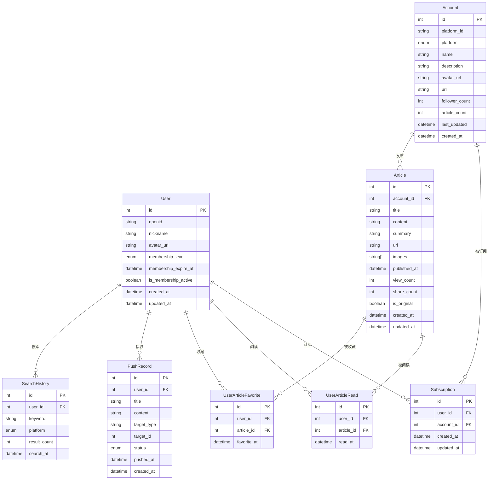

# 数据模型关系图

本文档描述了系统中的主要数据模型及其关系。

## 实体关系图

下面是主要实体的关系图：

## 主要数据模型说明

### User（用户）

用户模型存储应用的用户信息，包括：
- 基本信息：ID、微信OpenID、昵称、头像
- 会员信息：会员等级、到期时间、是否有效
- 时间戳：创建时间、更新时间

用户与其他实体的关系：
- 一个用户可以订阅多个账号（Subscription）
- 一个用户可以阅读多篇文章（UserArticleRead）
- 一个用户可以收藏多篇文章（UserArticleFavorite）
- 一个用户可以接收多条推送（PushRecord）
- 一个用户可以有多条搜索记录（SearchHistory）

### Account（账号）

账号模型存储各平台的博主/创作者账号信息：
- 基本信息：ID、平台ID、平台类型、名称、描述、头像、URL
- 统计信息：粉丝数、文章数
- 时间戳：最后更新时间、创建时间

账号与其他实体的关系：
- 一个账号可以被多个用户订阅（Subscription）
- 一个账号可以发布多篇文章（Article）

### Subscription（订阅）

订阅模型记录用户与账号之间的订阅关系：
- 关系映射：用户ID、账号ID
- 时间戳：创建时间、更新时间

### Article（文章）

文章模型存储账号发布的内容：
- 基本信息：ID、账号ID、标题、内容、摘要、URL、图片列表
- 发布信息：发布时间
- 统计信息：查看次数、分享次数、是否原创
- 时间戳：创建时间、更新时间

文章与其他实体的关系：
- 一篇文章属于一个账号（Account）
- 一篇文章可以被多个用户阅读（UserArticleRead）
- 一篇文章可以被多个用户收藏（UserArticleFavorite）

### UserArticleRead（用户文章阅读）

记录用户阅读文章的关系：
- 关系映射：用户ID、文章ID
- 时间戳：阅读时间

### UserArticleFavorite（用户文章收藏）

记录用户收藏文章的关系：
- 关系映射：用户ID、文章ID
- 时间戳：收藏时间

### PushRecord（推送记录）

记录向用户发送的推送通知：
- 基本信息：ID、用户ID、标题、内容、目标类型、目标ID
- 状态信息：推送状态
- 时间戳：推送时间、创建时间

### SearchHistory（搜索历史）

记录用户的搜索操作：
- 基本信息：ID、用户ID、关键词、平台
- 结果信息：结果数量
- 时间戳：搜索时间 