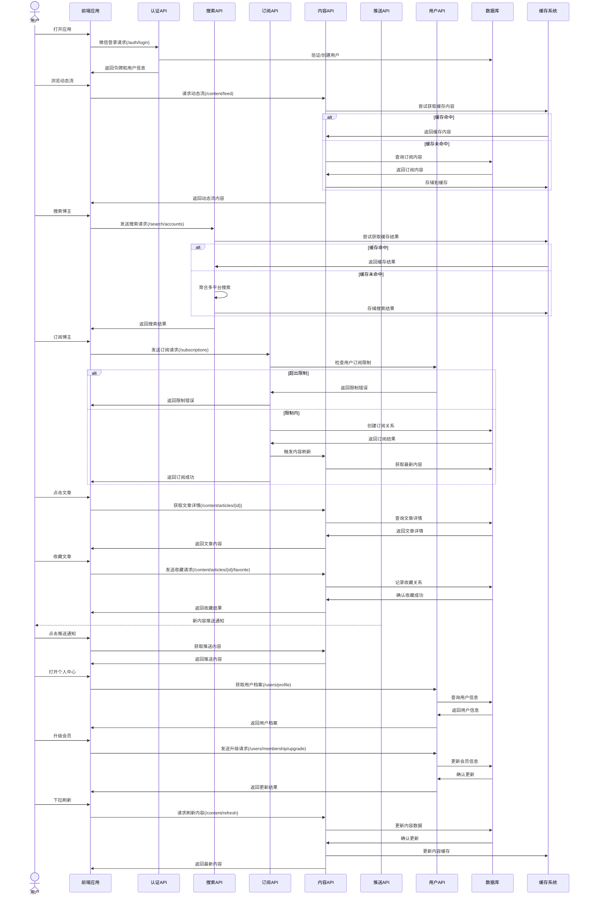

# 系统架构文档

本文档包含多平台内容聚合系统的架构设计和操作逻辑图。

## 1. 系统功能模块图

以下图表展示了系统的主要功能模块及其关系：

```mermaid
graph TD
    %% 主要用户流程
    U["用户/客户端"] --> |"登录/认证"| A["认证系统"]
    U --> |"获取内容"| C["内容系统"]
    U --> |"搜索博主"| S["搜索系统"]
    U --> |"管理订阅"| SUB["订阅系统"]
    U --> |"管理用户信息"| UM["用户管理"]
    U --> |"管理会员"| M["会员系统"]
    U --> |"接收推送"| P["推送系统"]
    
    %% 认证系统
    A --> |"微信登录"| A1["wechat_login"]
    A --> |"刷新令牌"| A2["refresh_token"]
    A --> |"登出"| A3["logout"]
    A --> |"验证状态"| A4["verify_token/auth_status"]
    
    %% 用户管理系统
    UM --> |"获取用户档案"| U1["get_user_profile"]
    UM --> |"更新用户档案"| U2["update_user_profile"]
    UM --> |"获取用户限制"| U3["get_user_limits"]
    UM --> |"删除账户"| U4["delete_user_account"]
    
    %% 会员系统
    M --> |"获取会员信息"| M1["get_membership_info"]
    M --> |"升级会员"| M2["upgrade_membership"]
    
    %% 订阅系统
    SUB --> |"获取订阅列表"| SUB1["get_user_subscriptions"]
    SUB --> |"创建订阅"| SUB2["create_subscription"]
    SUB --> |"批量创建订阅"| SUB3["batch_create_subscriptions"]
    SUB --> |"取消订阅"| SUB4["delete_subscription"]
    SUB --> |"获取订阅状态"| SUB5["check_subscription_status"]
    SUB --> |"获取订阅统计"| SUB6["get_subscription_stats"]
    
    %% 内容系统
    C --> |"获取动态流"| C1["get_user_feed"]
    C --> |"获取文章详情"| C2["get_article_detail"]
    C --> |"获取账号文章"| C3["get_articles_by_account"]
    C --> |"获取内容统计"| C4["get_content_stats"]
    C --> |"刷新内容"| C5["refresh_user_content"]
    C --> |"标记文章已读"| C6["mark_article_as_read"]
    C --> |"收藏/取消收藏"| C7["favorite/unfavorite_article"]
    C --> |"搜索文章"| C8["search_articles"]
    
    %% 搜索系统
    S --> |"搜索博主账号"| S1["search_accounts"]
    S --> |"平台搜索博主"| S2["search_accounts_by_platform"]
    S --> |"获取平台列表"| S3["get_supported_platforms"]
    S --> |"获取账号信息"| S4["get_account_by_id/platform_id"]
    S --> |"获取搜索统计"| S5["get_search_statistics"]
    
    %% 推送系统
    P --> |"获取推送设置"| P1["推送设置"]
    P --> |"触发推送"| P2["推送通知"]
    
    %% 主要数据流
    DB[(数据库)] --> A
    DB --> UM
    DB --> M
    DB --> SUB
    DB --> C
    DB --> S
    DB --> P
    
    %% 内部服务交互
    SUB -- "更新订阅关系" --> C
    C -- "内容更新" --> P
    S -- "账号信息" --> SUB
    A -- "用户认证" --> UM
    M -- "会员权限" --> SUB
    M -- "会员权限" --> C
```

## 2. 前后端交互架构图

以下图表展示了系统的前后端交互架构和内部组件关系：

```mermaid
graph TD
    %% 前端与后端交互
    classDef frontend fill:#f9d0c4,stroke:#333,stroke-width:1px
    classDef backend fill:#c4e3f9,stroke:#333,stroke-width:1px
    classDef database fill:#d5f9c4,stroke:#333,stroke-width:1px
    classDef service fill:#e3c4f9,stroke:#333,stroke-width:1px
    
    %% 前端组件
    FE["前端应用"] -->|HTTP请求| BE["后端API"]
    FE -->|"登录"| FE_Auth["身份验证"]
    FE -->|"浏览文章"| FE_Content["内容模块"]
    FE -->|"搜索"| FE_Search["搜索模块"]
    FE -->|"订阅管理"| FE_Sub["订阅模块"]
    FE -->|"用户中心"| FE_User["用户模块"]
    
    %% 后端API路由
    BE --> BE_Auth["认证路由(/auth)"]
    BE --> BE_User["用户路由(/users)"]
    BE --> BE_Sub["订阅路由(/subscriptions)"]
    BE --> BE_Content["内容路由(/content)"]
    BE --> BE_Search["搜索路由(/search)"]
    BE --> BE_Push["推送路由(/push-notifications)"]
    BE --> BE_Monitor["监控路由(/monitoring)"]
    
    %% 用户认证流程
    BE_Auth -->|"微信登录"| SVC_Auth["认证服务"]
    SVC_Auth -->|"验证code"| WechatAPI["微信API"]
    SVC_Auth -->|"生成令牌"| TokenGen["令牌生成器"]
    SVC_Auth -->|"存储用户信息"| DB_User[(用户数据)]
    
    %% 内容流程
    BE_Content -->|"获取文章"| SVC_Content["内容服务"]
    SVC_Content -->|"读取订阅内容"| DB_Article[(文章数据)]
    SVC_Content -->|"读取订阅关系"| DB_Sub[(订阅数据)]
    SVC_Content -->|"刷新内容"| SVC_Refresh["刷新服务"]
    SVC_Refresh -->|"抓取新内容"| PlatformAPI["平台API"]
    
    %% 搜索流程
    BE_Search -->|"搜索请求"| SVC_Search["搜索服务"]
    SVC_Search -->|"聚合搜索"| SearchAggregator["搜索聚合器"]
    SearchAggregator -->|"微信平台搜索"| WechatAdapter["微信适配器"]
    SearchAggregator -->|"微博平台搜索"| WeiboAdapter["微博适配器"]
    SearchAggregator -->|"推特平台搜索"| TwitterAdapter["推特适配器"]
    SVC_Search -->|"存取缓存"| SearchCache["搜索缓存"]
    
    %% 订阅流程
    BE_Sub -->|"管理订阅"| SVC_Sub["订阅服务"]
    SVC_Sub -->|"检查限制"| SVC_Limits["限制服务"]
    SVC_Sub -->|"读写订阅数据"| DB_Sub
    SVC_Limits -->|"检查会员等级"| DB_User
    
    %% 推送流程
    BE_Push -->|"发送推送"| SVC_Push["推送服务"]
    SVC_Push -->|"推送队列"| PushQueue["推送队列"]
    SVC_Push -->|"推送记录"| DB_Push[(推送记录)]
    PushQueue -->|"发送通知"| WechatAPI
    
    %% 数据库关系
    DB_Main[(主数据库)] --> DB_User
    DB_Main --> DB_Article
    DB_Main --> DB_Sub
    DB_Main --> DB_Push
    DB_Main --> DB_Account[(账号数据)]
    
    %% 缓存系统
    Redis[(Redis缓存)] --> SearchCache
    Redis --> TokenCache["令牌缓存"]
    Redis --> ContentCache["内容缓存"]
    
    %% 监控系统
    BE_Monitor -->|"收集指标"| Metrics["指标收集器"]
    Metrics -->|"存储指标"| Prometheus[(Prometheus)]
    
    %% 样式应用
    class FE,FE_Auth,FE_Content,FE_Search,FE_Sub,FE_User frontend
    class BE,BE_Auth,BE_User,BE_Sub,BE_Content,BE_Search,BE_Push,BE_Monitor backend
    class DB_Main,DB_User,DB_Article,DB_Sub,DB_Push,DB_Account,Redis,Prometheus database
    class SVC_Auth,SVC_Content,SVC_Search,SearchAggregator,WechatAdapter,WeiboAdapter,TwitterAdapter,SVC_Sub,SVC_Limits,SVC_Push,SVC_Refresh service
```

## 3. 用户操作流程图

以下图表展示了用户从登录到使用各项功能的完整流程：

## 4. 系统概述

该系统是一个多平台内容聚合应用，主要功能包括：

1. **用户认证系统**：通过微信小程序登录，生成JWT令牌进行身份验证
2. **用户管理系统**：管理用户档案、会员等级和使用限制
3. **搜索系统**：支持跨平台搜索博主账号，包括微信、微博、Twitter等
4. **订阅系统**：管理用户对不同平台博主的订阅关系
5. **内容系统**：聚合展示用户订阅博主的文章内容，支持阅读、收藏等操作
6. **推送系统**：向用户推送订阅博主的最新内容更新

系统采用前后端分离架构，后端基于FastAPI框架，使用SQLAlchemy进行数据库操作，Redis进行缓存，并集成了日志、监控和性能优化等功能。前端基于Vue.js开发，实现了响应式用户界面。

整个系统的核心流程是：用户登录 -> 搜索博主 -> 订阅博主 -> 浏览聚合内容 -> 接收内容更新推送，同时还支持会员升级来提升使用限制。 