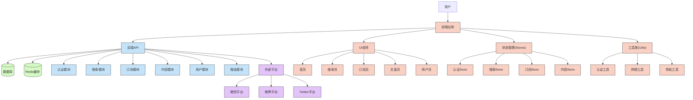
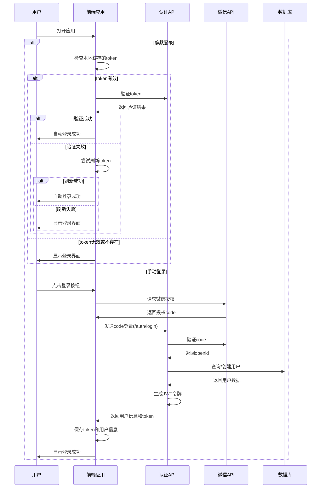
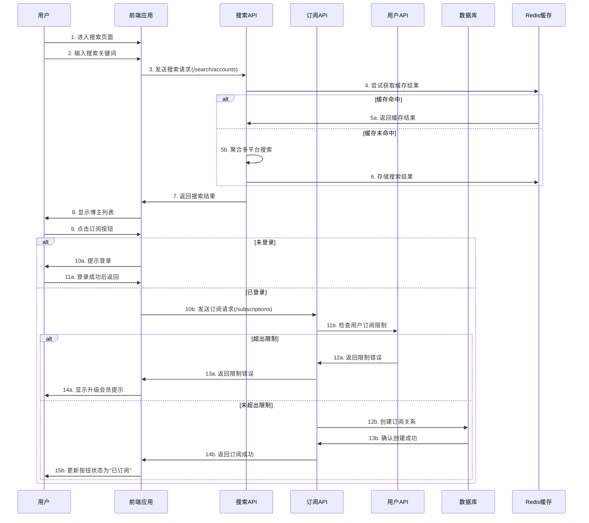
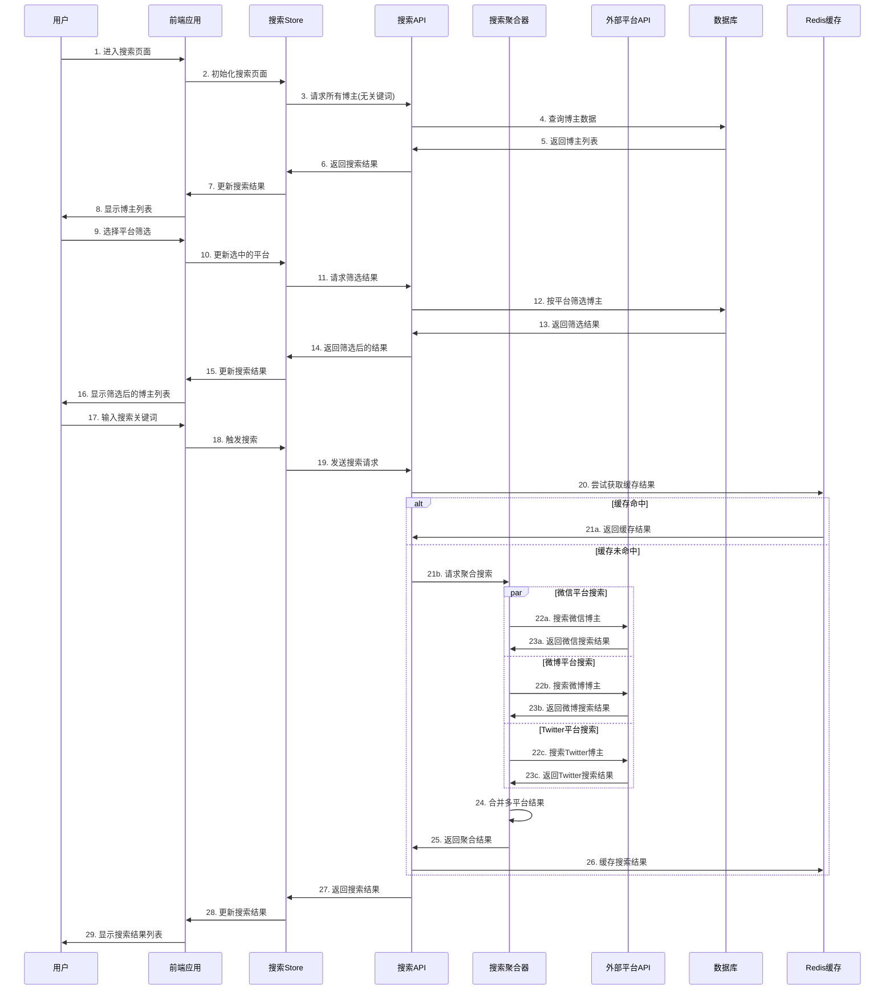
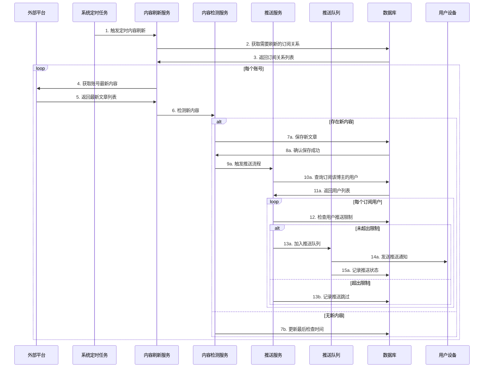
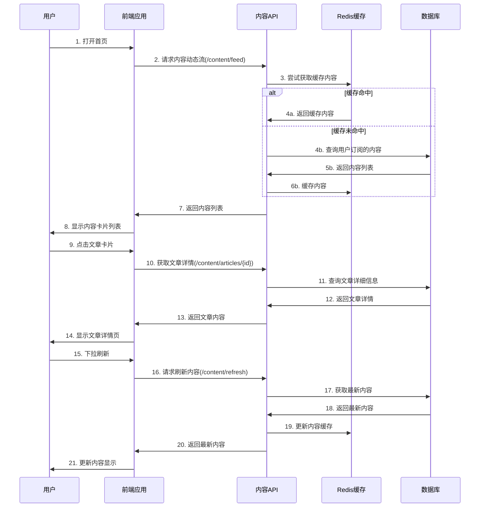

# 系统流程图文档

本文档包含多平台内容聚合系统的主要流程图，用于展示系统各模块的工作流程。

## 1. 系统整体架构图

```mermaid
graph TD
    %% 主要组件颜色定义
    classDef frontend fill:#f9d0c4,stroke:#333,stroke-width:1px
    classDef backend fill:#c4e3f9,stroke:#333,stroke-width:1px
    classDef database fill:#d5f9c4,stroke:#333,stroke-width:1px
    classDef external fill:#e3c4f9,stroke:#333,stroke-width:1px
    
    %% 系统核心架构
    用户["用户"] --> 前端应用["前端应用"]
    前端应用 --> 后端API["后端API"]
    后端API --> 数据库[(数据库)]
    后端API --> Redis[(Redis缓存)]
    
    %% 前端应用组件
    前端应用 --> 界面组件["UI组件"]
    前端应用 --> 状态管理["状态管理(Stores)"]
    前端应用 --> 工具类["工具类(Utils)"]
    
    界面组件 --> 首页["首页"]
    界面组件 --> 搜索页["搜索页"]
    界面组件 --> 订阅页["订阅页"]
    界面组件 --> 文章页["文章页"]
    界面组件 --> 用户页["用户页"]
    
    状态管理 --> 认证Store["认证Store"]
    状态管理 --> 搜索Store["搜索Store"]
    状态管理 --> 订阅Store["订阅Store"]
    状态管理 --> 内容Store["内容Store"]
    
    工具类 --> 认证工具["认证工具"]
    工具类 --> 网络工具["网络工具"]
    工具类 --> 导航工具["导航工具"]
    
    %% 后端API组件
    后端API --> 认证模块["认证模块"]
    后端API --> 搜索模块["搜索模块"]
    后端API --> 订阅模块["订阅模块"]
    后端API --> 内容模块["内容模块"]
    后端API --> 用户模块["用户模块"]
    后端API --> 推送模块["推送模块"]
    
    %% 外部平台
    后端API --> 外部平台["外部平台"]
    外部平台 --> 微信平台["微信平台"]
    外部平台 --> 微博平台["微博平台"]
    外部平台 --> 推特平台["Twitter平台"]
    
    %% 应用类别
    class 前端应用,界面组件,状态管理,工具类,首页,搜索页,订阅页,文章页,用户页,认证Store,搜索Store,订阅Store,内容Store,认证工具,网络工具,导航工具 frontend
    class 后端API,认证模块,搜索模块,订阅模块,内容模块,用户模块,推送模块 backend
    class 数据库,Redis database
    class 外部平台,微信平台,微博平台,推特平台 external
```

## 2. 登录流程图

```mermaid
sequenceDiagram
    %% 登录流程
    participant 用户
    participant 前端 as 前端应用
    participant 认证API as 认证API
    participant WeChat as 微信API
    participant 数据库
    
    用户->>前端: 打开应用
    alt 静默登录
        前端->>前端: 检查本地缓存的token
        alt token有效
            前端->>认证API: 验证token
            认证API->>前端: 返回验证结果
            alt 验证成功
                前端->>用户: 自动登录成功
            else 验证失败
                前端->>前端: 尝试刷新token
                alt 刷新成功
                    前端->>用户: 自动登录成功
                else 刷新失败
                    前端->>用户: 显示登录界面
                end
            end
        else token无效或不存在
            前端->>用户: 显示登录界面
        end
    else 手动登录
        用户->>前端: 点击登录按钮
        前端->>WeChat: 请求微信授权
        WeChat->>前端: 返回授权code
        前端->>认证API: 发送code登录(/auth/login)
        认证API->>WeChat: 验证code
        WeChat->>认证API: 返回openid
        认证API->>数据库: 查询/创建用户
        数据库->>认证API: 返回用户数据
        认证API->>认证API: 生成JWT令牌
        认证API->>前端: 返回用户信息和token
        前端->>前端: 保存token和用户信息
        前端->>用户: 显示登录成功
    end
```

## 3. 订阅流程图

```mermaid
sequenceDiagram
    %% 订阅流程
    participant 用户
    participant 前端 as 前端应用
    participant 搜索API as 搜索API
    participant 订阅API as 订阅API
    participant 用户API as 用户API
    participant 数据库
    participant 缓存 as Redis缓存
    
    %% 搜索博主
    用户->>前端: 1. 进入搜索页面
    用户->>前端: 2. 输入搜索关键词
    前端->>搜索API: 3. 发送搜索请求(/search/accounts)
    搜索API->>缓存: 4. 尝试获取缓存结果
    
    alt 缓存命中
        缓存->>搜索API: 5a. 返回缓存结果
    else 缓存未命中
        搜索API->>搜索API: 5b. 聚合多平台搜索
        搜索API->>缓存: 6. 存储搜索结果
    end
    
    搜索API->>前端: 7. 返回搜索结果
    前端->>用户: 8. 显示博主列表
    
    %% 订阅博主
    用户->>前端: 9. 点击订阅按钮
    
    alt 未登录
        前端->>用户: 10a. 提示登录
        用户->>前端: 11a. 登录成功后返回
    else 已登录
        前端->>订阅API: 10b. 发送订阅请求(/subscriptions)
        订阅API->>用户API: 11b. 检查用户订阅限制
        
        alt 超出限制
            用户API->>订阅API: 12a. 返回限制错误
            订阅API->>前端: 13a. 返回限制错误
            前端->>用户: 14a. 显示升级会员提示
        else 未超出限制
            订阅API->>数据库: 12b. 创建订阅关系
            数据库->>订阅API: 13b. 确认创建成功
            订阅API->>前端: 14b. 返回订阅成功
            前端->>用户: 15b. 更新按钮状态为"已订阅"
        end
    end
```

## 4. 搜索功能流程图

```mermaid
sequenceDiagram
    %% 搜索功能流程
    participant 用户
    participant 前端 as 前端应用
    participant 搜索Store as 搜索Store
    participant 搜索API as 搜索API
    participant 聚合器 as 搜索聚合器
    participant 外部API as 外部平台API
    participant 数据库
    participant 缓存 as Redis缓存
    
    %% 初始加载和平台筛选
    用户->>前端: 1. 进入搜索页面
    前端->>搜索Store: 2. 初始化搜索页面
    搜索Store->>搜索API: 3. 请求所有博主(无关键词)
    搜索API->>数据库: 4. 查询博主数据
    数据库->>搜索API: 5. 返回博主列表
    搜索API->>搜索Store: 6. 返回搜索结果
    搜索Store->>前端: 7. 更新搜索结果
    前端->>用户: 8. 显示博主列表
    
    %% 平台筛选
    用户->>前端: 9. 选择平台筛选
    前端->>搜索Store: 10. 更新选中的平台
    搜索Store->>搜索API: 11. 请求筛选结果
    搜索API->>数据库: 12. 按平台筛选博主
    数据库->>搜索API: 13. 返回筛选结果
    搜索API->>搜索Store: 14. 返回筛选后的结果
    搜索Store->>前端: 15. 更新搜索结果
    前端->>用户: 16. 显示筛选后的博主列表
    
    %% 关键词搜索
    用户->>前端: 17. 输入搜索关键词
    前端->>搜索Store: 18. 触发搜索
    搜索Store->>搜索API: 19. 发送搜索请求
    搜索API->>缓存: 20. 尝试获取缓存结果
    
    alt 缓存命中
        缓存->>搜索API: 21a. 返回缓存结果
    else 缓存未命中
        搜索API->>聚合器: 21b. 请求聚合搜索
        
        par 微信平台搜索
            聚合器->>外部API: 22a. 搜索微信博主
            外部API->>聚合器: 23a. 返回微信搜索结果
        and 微博平台搜索
            聚合器->>外部API: 22b. 搜索微博博主
            外部API->>聚合器: 23b. 返回微博搜索结果
        and Twitter平台搜索
            聚合器->>外部API: 22c. 搜索Twitter博主
            外部API->>聚合器: 23c. 返回Twitter搜索结果
        end
        
        聚合器->>聚合器: 24. 合并多平台结果
        聚合器->>搜索API: 25. 返回聚合结果
        搜索API->>缓存: 26. 缓存搜索结果
    end
    
    搜索API->>搜索Store: 27. 返回搜索结果
    搜索Store->>前端: 28. 更新搜索结果
    前端->>用户: 29. 显示搜索结果列表
```

## 5. 内容推送流程图

```mermaid
sequenceDiagram
    %% 内容推送流程
    participant 外部平台 as 外部平台
    participant 系统任务 as 系统定时任务
    participant 刷新服务 as 内容刷新服务
    participant 检测服务 as 内容检测服务
    participant 推送服务 as 推送服务
    participant 推送队列 as 推送队列
    participant 数据库
    participant 用户 as 用户设备
    
    %% 内容更新检测
    系统任务->>刷新服务: 1. 触发定时内容刷新
    刷新服务->>数据库: 2. 获取需要刷新的订阅关系
    数据库->>刷新服务: 3. 返回订阅关系列表
    
    loop 每个账号
        刷新服务->>外部平台: 4. 获取账号最新内容
        外部平台->>刷新服务: 5. 返回最新文章列表
        刷新服务->>检测服务: 6. 检测新内容
        
        alt 存在新内容
            检测服务->>数据库: 7a. 保存新文章
            数据库->>检测服务: 8a. 确认保存成功
            检测服务->>推送服务: 9a. 触发推送流程
            推送服务->>数据库: 10a. 查询订阅该博主的用户
            数据库->>推送服务: 11a. 返回用户列表
            
            loop 每个订阅用户
                推送服务->>数据库: 12. 检查用户推送限制
                
                alt 未超出限制
                    推送服务->>推送队列: 13a. 加入推送队列
                    推送队列->>用户: 14a. 发送推送通知
                    推送队列->>数据库: 15a. 记录推送状态
                else 超出限制
                    推送服务->>数据库: 13b. 记录推送跳过
                end
            end
        else 无新内容
            检测服务->>数据库: 7b. 更新最后检查时间
        end
    end
```

## 6. 内容浏览流程图

```mermaid
sequenceDiagram
    %% 内容浏览流程
    participant 用户
    participant 前端 as 前端应用
    participant 内容API as 内容API
    participant 缓存 as Redis缓存
    participant 数据库
    
    %% 首页内容加载
    用户->>前端: 1. 打开首页
    前端->>内容API: 2. 请求内容动态流(/content/feed)
    内容API->>缓存: 3. 尝试获取缓存内容
    
    alt 缓存命中
        缓存->>内容API: 4a. 返回缓存内容
    else 缓存未命中
        内容API->>数据库: 4b. 查询用户订阅的内容
        数据库->>内容API: 5b. 返回内容列表
        内容API->>缓存: 6b. 缓存内容
    end
    
    内容API->>前端: 7. 返回内容列表
    前端->>用户: 8. 显示内容卡片列表
    
    %% 查看文章详情
    用户->>前端: 9. 点击文章卡片
    前端->>内容API: 10. 获取文章详情(/content/articles/{id})
    内容API->>数据库: 11. 查询文章详细信息
    数据库->>内容API: 12. 返回文章详情
    内容API->>前端: 13. 返回文章内容
    前端->>用户: 14. 显示文章详情页
    
    %% 内容刷新
    用户->>前端: 15. 下拉刷新
    前端->>内容API: 16. 请求刷新内容(/content/refresh)
    内容API->>数据库: 17. 获取最新内容
    数据库->>内容API: 18. 返回最新内容
    内容API->>缓存: 19. 更新内容缓存
    内容API->>前端: 20. 返回最新内容
    前端->>用户: 21. 更新内容显示
``` 